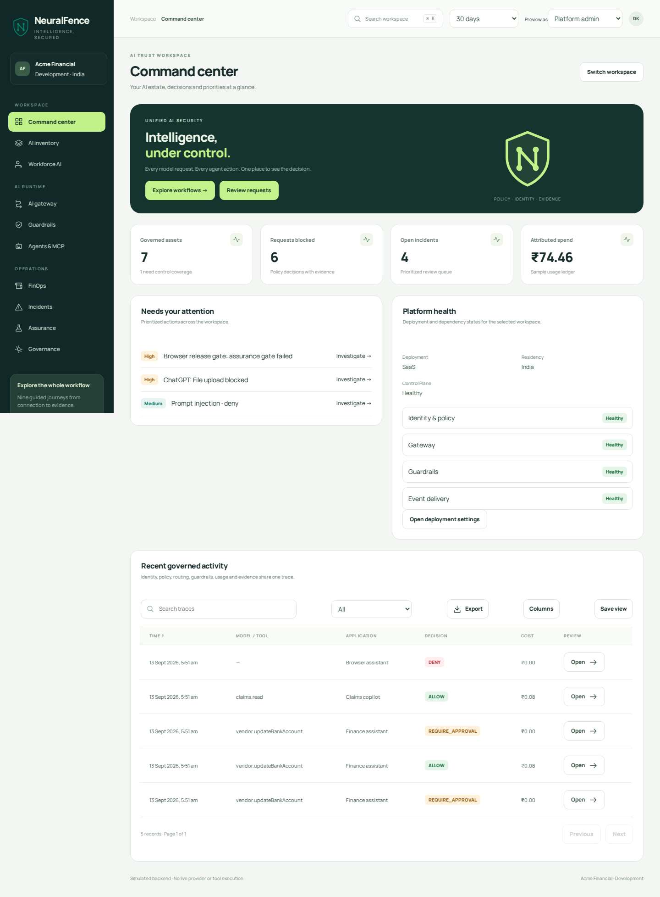

# Neurofence

Neurofence is an enterprise AI security and governance workspace. It brings model access, guardrails, agents and MCP tools, budgets, incidents, inventory and assurance into one console.

The React frontend has a stateful demo backend for working through the product flows. An optional local API connects the model playground to the LiteLLM backend source included in this repository.

[Open the demo](https://divyankavdia.github.io/Neurofence/) · [Product scope](docs/product-scope.md) · [Architecture](docs/architecture.md)



## Start developing

Use Node.js 24. Run these commands from the repository root:

```bash
npm ci
npm run dev
```

Open `http://127.0.0.1:8000`. Source changes rebuild automatically; refresh the browser to see them. Demo records persist in browser storage. Use **Explore workflows** for guided journeys and the profile menu to try another role or reviewer.

## Choose a run mode

| Mode | Start here | What runs |
| --- | --- | --- |
| Browser demo | `npm run dev` or the public demo | Console and shared demo logic; browser persistence; no backend account required |
| Local HTTP API | `npm run mock`, then open port 8080 | Same console and demo logic, with file persistence in `.runtime/data/` |
| LiteLLM model execution | [Runtime guide](integrations/litellm/README.md) | Local API plus the included LiteLLM source; fixture responses or explicitly configured live text models |

LiteLLM replaces model execution only. Identity preview, virtual credentials, detector examples, MCP execution, workforce collection and assurance scans remain prototypes. The HTTP API is for local evaluation; its demo identity headers are not authentication.

## Where to work

| Directory | Responsibility |
| --- | --- |
| `apps/console/src/app/` | Session, navigation, application shell and dialogs |
| `apps/console/src/features/` | Product pages and resource editors, grouped by feature |
| `apps/console/src/components/` | Shared tables, forms and accessible dialog controls |
| `apps/api/src/` | Local HTTP server, file storage and server-only provider adapters |
| `packages/contracts/src/` | Transport, resource and provider types; common budget calculations |
| `packages/demo-backend/src/` | Demo fixtures, transactions, resource handlers and execution decisions |
| `integrations/litellm/`, `vendor/litellm/` | Runtime configuration, source maintenance tools and imported LiteLLM backend |
| `infra/` | Local dependency services and Terraform for later cloud provisioning |
| `tests/` | API contracts, browser workflows and full runtime integration |

A single root `package.json` installs and builds the first-party TypeScript code. `index.html` and `assets/console/` are generated and committed for GitHub Pages. Edit source files and rebuild instead of editing those artifacts.

## Working guides

- [Development](docs/development.md): commands, common changes, testing and troubleshooting.
- [Architecture](docs/architecture.md): ownership, request flow and production boundaries.
- [API contract](docs/api.md) and [OpenAPI](docs/openapi.json): envelopes, actions, state transitions and backend replacement.
- [Product scope](docs/product-scope.md): all 25 primary screens and nine workflows.
- [LiteLLM](integrations/litellm/README.md): fixture setup, live configuration and upstream updates.
- [Infrastructure](infra/README.md): dependency map and Terraform provisioning sequence.

Before submitting a change, run `npm test`. See the development guide for browser setup and additional runtime gates. [GitHub Actions](https://github.com/DivyanKavdia/Neurofence/actions/workflows/validate.yml) is the current validation record. Terraform defines future dependencies; it has not provisioned a cloud backend.
