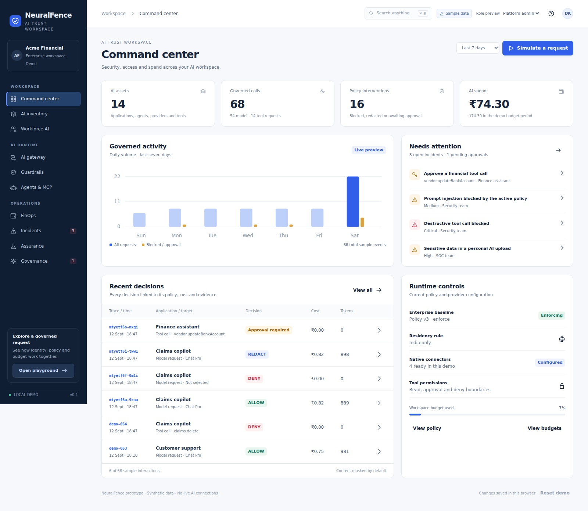

# NeuralFence prototype

Working HTML wireframe for the enterprise AI trust workspace in this repository, **Neurofence**. It connects model access, guardrails, agent tool approvals, budgets, incidents and audit evidence through shared demo state.



## Open the prototype

GitHub Pages address, once enabled: **[Open NeuralFence](https://divyankavdia.github.io/Neurofence/)**. The same link works on desktop and mobile.

Download or clone this repository, then open **`index.html`** in a browser. The application has no build step, runtime dependencies or external network calls.

```bash
git clone https://github.com/DivyanKavdia/Neurofence.git
cd Neurofence
```

To serve it locally with Python 3:

```bash
python3 -m http.server 8000 --bind 127.0.0.1
```

Open <http://localhost:8000>. The GitHub repository view displays source code; it is not a running application.

## Test on a phone

Once GitHub Pages is enabled, open **<https://divyankavdia.github.io/Neurofence/>** in Safari or Chrome on your phone. No local server is needed for the hosted version.

For local development, run the server from this repository on your computer:

```bash
python3 -m http.server 8000 --bind 0.0.0.0
```

Connect the phone to the same Wi-Fi, then open `http://COMPUTER-IP:8000` in Safari or Chrome. Replace `COMPUTER-IP` with your computer's local Wi-Fi IP address. Keep the server running while testing; press Ctrl+C to stop it. On Windows, use `py -3` if `python3` is unavailable.

## Publish on GitHub Pages

The repository is prepared for direct static publishing from **`main` → `/ (root)`**. The root `index.html` is the application entry point; `.nojekyll` lets Pages serve the files without a Jekyll build.

One-time repository setup:

1. Open [Settings → Pages](https://github.com/DivyanKavdia/Neurofence/settings/pages).
2. Under **Build and deployment → Source**, select **Deploy from a branch**.
3. Choose **main** and **/ (root)**, then click **Save**.
4. Wait for the **pages build and deployment** run in [Actions](https://github.com/DivyanKavdia/Neurofence/actions) to succeed, then open [the prototype](https://divyankavdia.github.io/Neurofence/).

Subsequent pushes to `main` publish automatically. See [GitHub's publishing-source instructions](https://docs.github.com/en/pages/getting-started-with-github-pages/configuring-a-publishing-source-for-your-github-pages-site) for the settings flow.

## Try the connected workflows

| Journey | Starting point | What to try |
| --- | --- | --- |
| Governed model request | AI gateway → Playground | Run the safe, sensitive-data and prompt-injection examples. Inspect the decision, execution stages and cost. |
| Human tool approval | Agents & MCP → Tool playground | Request `vendor.updateBankAccount` as Platform admin. Switch to Security admin to approve it with a reason, then explicitly rerun the exact request. |
| Policy lifecycle | Guardrails → Policy builder | As Security admin, save a draft, test it in Simulator, publish it and restore an earlier configuration. |
| Budget enforcement | FinOps → Budget hierarchy | Lower the workspace or application hard limit and rerun a request. Every applicable parent budget is checked. |
| Incident response | Incidents | As Security admin, inspect a finding, contain its agent and record a resolution note. |
| Evidence | AI gateway → Traces; Governance → Audit trail | Follow the recorded decisions and export JSON evidence. |

The role selector is a **role preview**. Pending or denied tool requests stop before execution. Approvals are tied to the exact agent, tool, arguments, workflow and policy version, and are consumed once. Publishing a policy invalidates outstanding approvals.

Changes are stored in the browser's local storage. Use **Reset demo** to restore the sample state. Different devices, browsers and web addresses keep separate demo data.

## Screens

The prototype contains 10 navigation areas and 26 main page/tab views, plus workflow dialogs.

- [Model request playground](docs/screenshots/model-playground.jpg)
- [Mobile tool approval](docs/screenshots/mobile-tool-approval.jpg)
- [Command center](docs/screenshots/command-center.jpg)

## Browser checks

The browser suite covers navigation, role restrictions, model decisions, scope checks, approval consumption, policy publication and rollback, budgets, containment, exports, persistence and mobile navigation.

Requires Node.js 20 or later:

```bash
npm ci
npx playwright install chromium
npm test
```

Results and screenshots are written to `test-results/`, which is excluded from Git. On Linux CI, `npx playwright install --with-deps chromium` installs the required browser system packages as well.

To use an already installed Chromium executable, set `NEUROFENCE_BROWSER_PATH`. `NEUROFENCE_SOFTWARE_RENDERING=1` enables the graphics flags used by the constrained headless validation environment.

## Project files

| Path | Purpose |
| --- | --- |
| `index.html` | Complete responsive app, inline styles, demo state and interaction handlers |
| `.nojekyll` | Direct static publishing on GitHub Pages |
| `tests/prototype.cjs` | Portable browser regression checks |
| `docs/screenshots/` | Selected desktop and mobile JPG previews |
| `package.json`, `package-lock.json` | Development test dependency and commands |

## Current implementation boundary

This is a browser prototype using synthetic data and deterministic example checks. Provider responses, tool execution, credentials, role authorization, budget reservations and audit evidence are simulated. There is no backend, production detector, live provider connection, signed audit store or server-side retention enforcement.

The repository includes the source, browser checks and Pages setup. Repository administrators enable the hosted site using the one-time settings step above.
