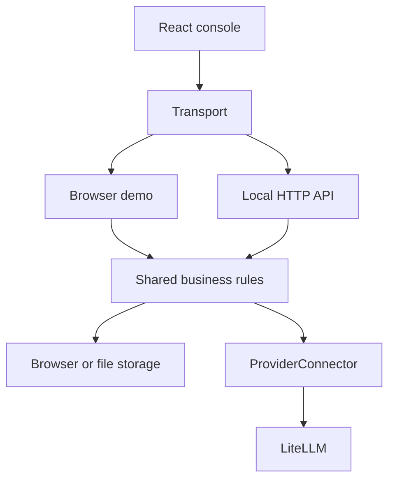

# Architecture

The console and local HTTP API share one TypeScript demo backend. LiteLLM is an optional model-execution adapter. Terraform describes dependencies for the future production backend.

The browser uses the mock execution path. Only the server can supply the LiteLLM connector; provider credentials stay there.

## Code ownership

| Area                            | Responsibility                                                              |
| ------------------------------- | --------------------------------------------------------------------------- |
| `apps/console/src/app/App.tsx`  | Compose context, loading state, layout and dialog host                      |
| `app/useConsoleState.tsx`       | Session, transport requests, refresh, routing and temporary UI state        |
| `app/layout/`                   | Sidebar, header, page frame and mobile navigation                           |
| `app/navigation.ts`, `Page.tsx` | Navigation definitions and feature selection                                |
| `apps/console/src/features/`    | Product pages and their editors; policy testing is in `guardrails/testing/` |
| `apps/console/src/components/`  | Reusable controls with shared focus, error and busy behavior                |
| `apps/api/src/`                 | HTTP adapter, file storage and server-only provider connection              |
| `packages/contracts/src/`       | Shared records, transport, provider and identity interfaces                 |
| `packages/demo-backend/src/`    | Business rules, state transitions and synthetic execution                   |

Imports across packages use `@neurofence/contracts/*` and `@neurofence/demo-backend`. Imports within an area are relative. Contracts contain no UI or filesystem code. Shared packages do not import from `apps/`.

## Follow a request

1. A page calls `ConsoleContext.request` or `mutate`. Mutations include a request key and the applicable record version.
2. `backend.ts` captures the session and serializes work. `context.ts` resolves membership, clones the company/environment state and exposes scoped lookup and persistence helpers.
3. `dispatch.ts` checks repeat receipts, then routes to `company/`, `handlers/`, `workflows/` or generic `resources/` actions.
4. `execution/` checks identity, policy, route and budget before producing a model/tool decision. LiteLLM calls pass through the same Neurofence checks.
5. Before an external model call, `handlers/runtime.ts` persists a pending receipt, trace and reservation. The result updates that trace. Ambiguous outcomes retain the reservation and require reconciliation.
6. The action persists state and returns the [API envelope](api.md). Raw content is omitted from saved traces when retention is disabled.

Keep authorization before data access, and persistence checkpoints before external execution. Changing this order can cause an unauthorized call or a duplicate charge.

## Company actions

`company/handler.ts` owns authorization, receipt replay and routing. `transaction.ts` owns company versions, audit entries and directory writes. The domain handlers are `configuration.ts`, `people.ts`, `operator.ts` and `setup.ts`.

Company membership and published defaults are shared across environments. Resource records and activity are scoped to company/environment. Configuration resolves company → team → environment → project, with locked keys enforced. Company controls supplement independently published resource policies. See [company administration](company-administration.md).

## Persistence and integration boundaries

| Concern         | Current behavior                                                                                                                 |
| --------------- | -------------------------------------------------------------------------------------------------------------------------------- |
| Browser state   | Local storage; a Web Lock serializes writes across tabs when supported                                                           |
| HTTP state      | Encoded scope filenames and flushed atomic replacement; run one API process                                                      |
| Migration       | Additive defaults preserve saved workspaces; legacy fixtures remain for compatibility                                            |
| Retry receipts  | Ordinary receipts are in memory; company receipts are bounded in the directory; external model receipts persist in the workspace |
| Background work | Synthetic jobs advance through polling                                                                                           |
| LiteLLM source  | Tracked under `vendor/litellm/`; maintained through the [integration tools](../integrations/litellm/README.md)                   |

These stores do not provide distributed transactions. The [handover guide](handover.md#suggested-backend-order) describes the replacement order. The [infrastructure guide](../infra/README.md) maps future service dependencies; they are optional for frontend development.
